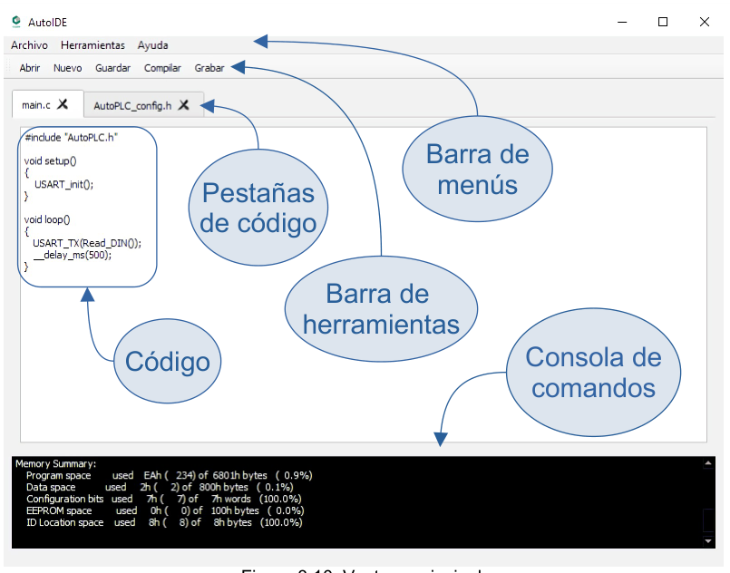
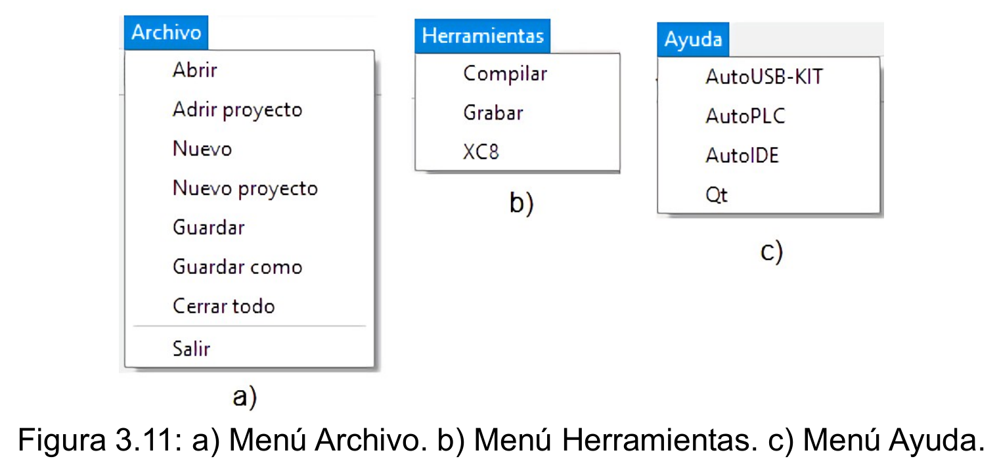

# AutoPLC-IDE

La ventana principal integra todas las herramientas y opciones de la aplicación, incluido el editor de texto plano para la escritura del código a compilar. En la parte inferior de esta pantalla destaca una consola de comandos, que sirve para la visualización de errores de código y los mensajes que se producen al compilar código contenido en los archivos del proyecto.

La barra de menús (Figura 3.10) muestra una serie de menús desplegables que contienen opciones útiles para el usuario. El menú archivo (Figura 3.11) muestra algunas opciones ya presentes en la barra de herramientas y las opciones de Abrir proyecto y Nuevo proyecto. Estas opciones permiten al usuario crear un nuevo directorio de proyecto o abrir un directorio de proyecto existente. Un directorio de proyecto en esta aplicación se define como una carpeta que su nombre termina con “.Apro”. El directorio de proyecto contiene los archivos de proyecto y una carpeta con los archivos de compilación, llamada comp. La opción Abrir proyecto realiza una llamada al método getExistingDirectory de clase QfileDialog, que despliega un cuadro de diálogo con las opciones de un explorador de archivos, para que el usuario escoja un directorio de proyecto existente. Cuando el usuario selecciona el directorio de proyecto, la lista de archivos de proyecto es cargada con la dirección de cada uno de los archivos y estos son mostrados en distintas pestañas de código en la ventana principal. Por otro lado, la opción Nuevo proyecto llama al método getSaveFileName para crear un nuevo directorio de proyecto en la ruta especificada por el usuario donde genera automáticamente el archivo main.c y lo despliega en una pestaña de código.

____

<dezamora98@gmail.com>
